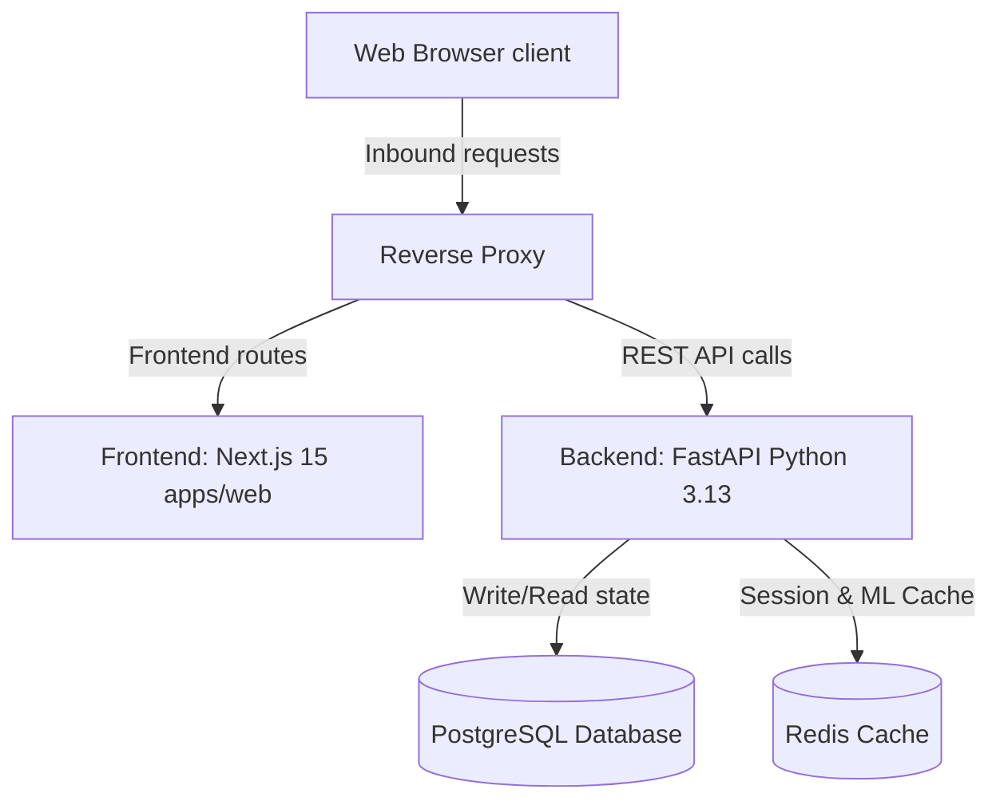

# System Architecture Documentation

This document outlines the architecture design, technology choices, and system components of **Quantara**, an institutional-grade swing trading copilot for Indian retail investors.

---

## 1. Design & Visual Philosophy

The user interface balances aesthetics and simplicity based on these targets:
* **40% Robinhood**: Extreme simplicity, bold metrics, immediate accessibility.
* **30% Apple**: Premium typography, grid alignment, glassmorphic menus, high contrast ratios.
* **20% Linear**: Flat, border-constrained dark mode themes with fast keyboard navigation mapping.
* **10% TradingView**: Interactive, performance-efficient price chart visualizers.

---

## 2. High-Level System Architecture

Quantara uses a containerized, decoupled architecture inside a shared Docker overlay network:



---

## 3. Technology Stack

### Frontend Monorepo (`frontend/`)
* **Next.js 15 & React 19**: Leverages server-side static generation and concurrent render boundaries.
* **Tailwind CSS v4**: Enforces color theme rules directly in stylesheets.
* **Lightweight Charts**: Implements TradingView's official Canvas-based charting engine.
* **Zustand & TanStack Query**: Split client layouts state from HTTP query cache states.

### Backend APIs (`backend/`)
* **FastAPI (Python 3.13) & Poetry**: High concurrency asynchronous web server.
* **SQLAlchemy 2.0 & asyncpg**: Type-safe relational mappings with async postgres connection pooling.
* **Redis Client**: Key-value cache store with prefixed namespace structures for sessions, market rates, and predictions.
* **Pydantic v2 Settings**: Validates environment values at startup.

---

## 4. Key Directory Structures

```text
quantara/
├── .github/workflows/    # CI pipelines (ESLint, build, Ruff validations)
├── ai/src/               # Interfaces for Mentor, Memory, RAG, and Tool Caller
├── backend/app/          # FastAPI async database/cache connections and schemas
├── database/             # PostgreSQL schema and seed files
├── docker/               # Compose file and frontend/backend Dockerfiles
├── docs/                 # Platform, Database, and API documents
├── frontend/apps/web/    # Next.js web application
└── ml/src/               # Predictors interface hooks (trend, price, profit, risk)
```
